<br>

<div align="center">

<h2>Engin ARSLAN</h2>

<p>
	<strong>Yazılım Geliştirici ve Udemy Eğitmeni</strong>
</p>

<p>
Güvenli, performanslı, test edilebilir ve sürdürülebilir yazılım çözümleri
</p>

<br><br>

<table>
<tr>

<td>

</td>

<td>

</td>

</tr>
</table>

</div>

---

## HAKKIMDA

Yazılım geliştirme sürecinde yalnızca çalışan uygulamalar geliştirmeye değil; **güvenli, performanslı, test edilebilir ve sürdürülebilir** çözümler üretmeye odaklanıyorum.

Özellikle **C#**, SQL, nesne yönelimli programlama ve uygulama geliştirme alanlarında çalışmalar yapıyorum.

Kod geliştirirken temel yaklaşımım:

* Güvenliği tasarım aşamasından itibaren dikkate almak
* Gereksiz kod ve karmaşıklıktan kaçınmak
* Performans darboğazlarını önceden tespit etmek
* Test edilebilir yapılar oluşturmak
* Kodun uzun vadede bakımını kolaylaştırmak
* Tekrarlanan kodları ve gereksiz işlemleri azaltmak
* Hataları doğru şekilde yönetmek
* Kullanıcı girdilerini güvenli şekilde doğrulamak

---

## TEKNİK ALANLAR

### Programlama ve Backend

* C#
* Nesne Yönelimli Programlama (OOP)
* LINQ
* Asenkron Programlama
* Exception (Hata) Yönetimi
* Girdi Doğrulama

### Veritabanı

* SQL
* İlişkisel Veritabanı Yapıları
* CRUD İşlemleri
* Sorgu Optimizasyonu
* Veri Doğrulama

### Yazılım Geliştirme

* Temiz Kod
* SOLID Prensipleri
* Tasarım Kalıpları
* Performans Optimizasyonu
* Güvenli Kodlama
* Test Edilebilir Mimari
* Hata Yönetimi ve Loglama
* Sürdürülebilir Yazılım Tasarımı

---

## PROJELER

GitHub üzerinde farklı seviyelerde yazılım projeleri, uygulamalar ve eğitim amaçlı çalışmalar geliştiriyorum.

Projelerimde özellikle şu yaklaşımı benimsemeye çalışıyorum:

**Güvenlik → Performans → Test Edilebilirlik → Sürdürülebilirlik**

Çalışma alanlarım arasında:
* C# uygulamaları
* Eğitim amaçlı yazılım projeleri
* Gerçek dünya senaryolarına yönelik uygulamalar
* Problem çözme ve algoritma çalışmaları

bulunuyor.

### Dinamik il-ilçe Seçimi:
https://github.com/EnginArslan49/dinamik-il-ilce-secimi

### Siber Güvenlik (Kaynak • Araştırma):
https://github.com/EnginArslan49/siber-guvenlik-egitimi-turkce-kapsamli-rehber

### STOK360 (Otomasyon):
https://github.com/EnginArslan49/Stok360-Stok-Y-netim-Satis-Raporlama-Sistemi

### Prompt Döngü Mğhendisliği (Araştırma):
https://github.com/EnginArslan49/prompt-dongu-muhendisligi-loop-engineering-arastirma

### Online Optik Sınav Değerlendirici:
https://github.com/EnginArslan49/online-optik-sinav-degerlendirici

### Sıfırdan Youtube ve Udemy C# Eğitimi:
https://github.com/EnginArslan49/Sifirdan-CSharp-YouTube-Serisi

### Açıköğretim Yönetim Sistemi (AYM):
https://github.com/EnginArslan49/Acikogretim-Yonetim-Sistemi

ve daha nicesi sizleri çalışma alanımdaki repolarda bekliyor.

---

## EĞİTİM İÇERİKLERİ

C# ve yazılım geliştirme üzerine Türkçe eğitim içerikleri hazırlıyorum.

### Sıfırdan C# Eğitimi

C# öğrenmeye yeni başlayanlar için hazırladığım eğitim serisinde yalnızca kodların nasıl yazıldığını değil, **bir yazılımcının problem karşısında nasıl düşünmesi gerektiğini** de anlatıyorum.

Değişkenlerden veri tiplerine, dizilerden metotlara, kullanıcı girdilerinden uygulama geliştirmeye kadar temel C# konularını uygulamalar üzerinden ele alıyorum.

### GitHub

C# eğitim serisine ait kaynak kodlara GitHub üzerinden ulaşabilirsiniz:

**Sıfırdan C# Eğitimi (Udemy):**
https://www.udemy.com/course/enginarslan-sifirdan-c-sharp-egitimi/?referralCode=C8A5FCF815E13E53C6DB

**Sıfırdan C# Eğitimi (YouTube):**
https://github.com/EnginArslan49/Sifirdan-CSharp-YouTube-Serisi

### YouTube

C# ve yazılım geliştirme içerikleri:
https://www.youtube.com/@ramkafe
<table>
	<td>
		
	</td>
</table>

---

## Yazılım Geliştirme Yaklaşımım

Bir çözümün yalnızca çalışması benim için yeterli değil.

Bir uygulama geliştirirken mümkün olduğunca şu kriterleri dikkate alıyorum:

```text
Güvenlik
   ↓
Performans
   ↓
Test Edilebilirlik
   ↓
Sürdürülebilirlik
   ↓
Basitlik
```

Amacım, bugün çalışan ancak ilerleyen süreçte bakım maliyeti oluşturan kodlar yerine; **anlaşılabilir, güvenli ve geliştirilebilir** yazılımlar üretmek.

---

## GitHub'da Neler Bulabilirsiniz?

Bu profilde ağırlıklı olarak:

* C# projeleri
* Araştırmalar | Makaleler
* Siber güvenlik
* Algoritma ve problem çözme örnekleri
* Eğitim içerikleri
* Eğitim projeleri
* Uygulama geliştirme çalışmaları
* Yazılım geliştirme deneyleri
* Öğrenme ve araştırma amaçlı projeler

bulabilirsiniz.

---

## İletişim

**E-posta:**
[arslanengin3175@gmail.com](mailto:arslanengin3175@gmail.com)

**YouTube:**
https://www.youtube.com/@ramkafe

**Github:**
https://github.com/EnginArslan49?tab=repositories

**Instagram:**
https://www.instagram.com/49engn04

---

<div align="center">

### ARSLAN YAZILIM
### Güvenli · Performanslı · Sürdürülebilir Yazılım

</div>
